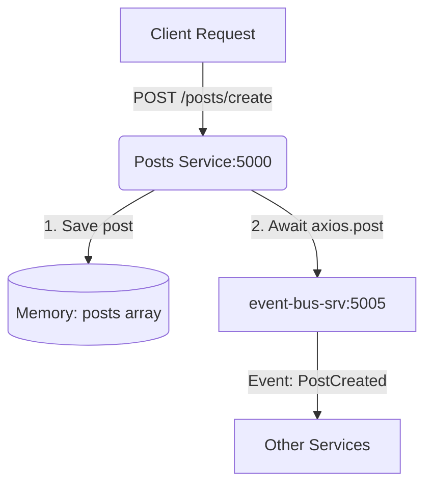

# Overview

---

# What is This Service?

The **Posts Service** is a simple backend API that lets users create and view blog posts. It's part of a bigger microservices project where different services talk to each other through events.

**What you'll learn:**

- Building REST APIs with Express.js
- Event-driven architecture basics
- How microservices communicate
- Working with Docker and Kubernetes

**Tech Stack:**

- Node.js + Express (backend framework)
- Axios (for HTTP requests)
- In-memory storage (just an array for now)

---

# 1\. Project Setup and Dependencies

For the Posts service to run, you need to install the following dependencies in your project's root folder **monoblog >** <SwmPath>[posts/](/posts/)</SwmPath>

- <SwmToken path="/posts/routes.js" pos="1:2:2" line-data="const express = require(&#39;express&#39;);">`express`</SwmToken> - The core web framework.
- <SwmToken path="/posts/index.js" pos="2:9:9" line-data="const cors = require(&quot;cors&quot;);">`cors`</SwmToken> - Enables Cross-Origin Resource Sharing.
- <SwmToken path="/posts/index.js" pos="58:3:3" line-data="    await axios.post(&quot;http://event-bus-srv:5005/events&quot;, {">`axios`</SwmToken> - HTTP client used to send events to the Event Bus.

If you are not in the posts folder, go to the posts folder

> cd posts

Run installation command

> npm i&nbsp;

# 2\. Starting service

o start the service using nodemon (for automatic restarts during development), use the npm start script defined in your **Monoblog** > <SwmPath>[posts/package.json](/posts/package.json)</SwmPath>.

If you are not in the posts folder in you terminal, go to the posts folder

> cd posts

Run command

> npm start

You should now see in the terminal

> \\> posts@1.0.0 start
>
> \\> nodemon index.js
>
> \[nodemon\] 3.1.10
>
> \[nodemon\] to restart at any time, enter `rs`
>
> \[nodemon\] watching path(s): _._
>
> \[nodemon\] watching extensions: js,mjs,cjs,json
>
> \[nodemon\] starting `node index.js`
>
> Posts Service is running on <http://localhost:5000>

# 3\. How Does It Work?&nbsp;

**Simple explanation:** When someone creates a post, two things happen:

1. The post gets saved in memory (in an array)
2. An event is sent to the Event Bus to notify other services

**Why events?** This lets other services (like Comments or Query) know about new posts without directly calling them. It's like posting on a group chat - everyone interested can see it!



**Important to know:**

- Posts are stored in an array (not a real database yet)
- When the service restarts, all posts are lost
- Each post gets an ID and has a title

# 4\. API Endpoints

This service provides two main API functionalities: creating a new post and retrieving all posts. The data is currently stored in the in-memory <SwmPath>[posts/index.js](/posts/index.js)</SwmPath> array.

<SwmSnippet path="/posts/index.js" line="46">

---

&nbsp;

```javascript
const post = {
  id: idCounter++,
  title,
  body,
  createdAt: new Date().toISOString(),
  commentsCount: 0,
};
```

---

</SwmSnippet>

## 4.1 POST <SwmPath>[posts/](/posts/)</SwmPath>: Making a Post

<SwmSnippet path="/posts/index.js" line="39">

---

This endpoint handles the creation of a new post, assigns a unique ID, and attempts to notify the Event Bus about the new post using the internal service name <SwmToken path="/posts/index.js" pos="58:10:14" line-data="    await axios.post(&quot;http://event-bus-srv:5005/events&quot;, {">`event-bus-srv`</SwmToken>

```javascript
app.post("/posts/create", async (req, res) => {
  const { title, body } = req.body;

  if (!title || !body) {
    return res.status(400).json({ message: "title and body are required" });
  }

  const post = {
    id: idCounter++,
    title,
    body,
    createdAt: new Date().toISOString(),
    commentsCount: 0,
  };

  posts.unshift(post);

  // Communicate with Event Bus via Service Name
  try {
    await axios.post("http://event-bus-srv:5005/events", {
      type: "PostCreated",
      data: post,
    });
  } catch (e) {
    console.log("Failed to publish PostCreated:", e.message);
  }

  res.status(201).json(post);
});
```

---

</SwmSnippet>

### 4.1.1Request Example

Url: <http://localhost:5000/posts/create> or <https://blog.local/posts/create>&nbsp;

Method: POST

Request body (raw)

```json
{
    "title": "Making first post"
    "body": "This is the content of my post"
}
```

Response: 201 Created

## 4.2 GET /posts: Getting all Posts

### 4.2.1 Request Example

<SwmSnippet path="/posts/index.js" line="35">

---

This endpoint returns the current contents of the in-memory <SwmToken path="/posts/index.js" pos="35:6:6" line-data="app.get(&quot;/posts&quot;, (req, res) =&gt; {">`posts`</SwmToken> array. It is useful for debugging the state of the **Posts Service** directly.

```javascript
app.get("/posts", (req, res) => {
  res.json(posts);
});
```

---

</SwmSnippet>

Url [http://localhost:5000/posts]()

Method: GET

Response

```json
[
  {
    "id": 0,
    "title": "My First Post",
    "body": "This is the content of my post",
    "createdAt": "2024-05-20T12:00:00.000Z",
    "commentsCount": 0
  }
]
```

# 6\. What's a Post Object?

A post is a JavaScript object that contains the data sent by the user along with metadata generated by the service.

```javascript
{
  "id": 0,                           // Auto-generated integer (not a string)
  "title": "My Post",                // Sent by user (required)
  "body": "This is my content",      // Sent by user (required)
  "createdAt": "2024-05-20T...",     // ISO 8601 Timestamp
  "commentsCount": 0                 // Initialized to zero
}
```

### Important details:

- **Data Types**: The <SwmToken path="/posts/index.js" pos="47:1:1" line-data="    id: idCounter++,">`id`</SwmToken> is now a numeric counter (<SwmToken path="/posts/index.js" pos="47:4:4" line-data="    id: idCounter++,">`idCounter`</SwmToken>`++`), not a string.

- **New Fields**: We now track the <SwmToken path="/posts/index.js" pos="40:8:8" line-data="  const { title, body } = req.body;">`body`</SwmToken>, <SwmToken path="/posts/index.js" pos="50:1:1" line-data="    createdAt: new Date().toISOString(),">`createdAt`</SwmToken> time, and a <SwmToken path="/posts/index.js" pos="51:1:1" line-data="    commentsCount: 0,">`commentsCount`</SwmToken> to show how many comments the post has.

- **Persistence**: The ID resets to <SwmToken path="/posts/index.js" pos="51:4:4" line-data="    commentsCount: 0,">`0`</SwmToken> every time the service restarts because data is stored in a local array.

---

# 7\. Common Issues & Solutions&nbsp;

## "Posts disappear when I restart!"

**This is normal!** The posts are stored only in an in-memory array. Since they are in RAM and not saved to a persistent database, the array is cleared every time the service stops or restarts.

## "Can't connect to Event Bus"

If you see the error message <SwmToken path="/posts/index.js" pos="63:6:12" line-data="    console.log(&quot;Failed to publish PostCreated:&quot;, e.message);">`Failed to publish PostCreated`</SwmToken> in your terminal, the service cannot reach the Event Bus.

- **Check Service Name:** Ensure your code uses <SwmToken path="/posts/index.js" pos="58:8:18" line-data="    await axios.post(&quot;http://event-bus-srv:5005/events&quot;, {">`http://event-bus-srv:5005/events`</SwmToken>. The <SwmToken path="/posts/index.js" pos="58:13:14" line-data="    await axios.post(&quot;http://event-bus-srv:5005/events&quot;, {">`-srv`</SwmToken> suffix is critical for Kubernetes DNS.
- **Check Pods:** Verify the Event Bus pod is running in your cluster:&nbsp;&nbsp;&nbsp;

```plaintext
 kubectl get pods
```

- **Check Logs:** Use `kubectl logs [event-bus-pod-name]` to see if the Event Bus is receiving requests.

```plaintext
 kubectl logs [event-bus-pod-name]
```

## "Port 5000 already in use"

This happens if you try to start the service while another process (or an old instance of this service) is already using port 5000.

- Stop the other service
- Change the PORT in <SwmPath>[posts/index.js](/posts/index.js)</SwmPath>

---

# 8\. Testing Your Service

## Using cURL (Terminal)

**Create a post:**

```bash
curl -X POST http://localhost:5000/posts/create \
  -H "Content-Type: application/json" \
  -d '{"title": "Hello World", "body": "This is my content"}'
```

**Get all posts:**

```bash
curl http://localhost:5000/posts
```

## Using Postman or Thunder Client

1. **Create POST** → <SwmToken path="/posts/index.js" pos="58:8:8" line-data="    await axios.post(&quot;http://event-bus-srv:5005/events&quot;, {">`http`</SwmToken>`://localhost:5000/posts/create` **või** <SwmToken path="/posts/index.js" pos="9:2:2" line-data="  &quot;https://blog.local&quot;,">`https`</SwmToken>`://blog.local/posts/create` kui kasutad **Ingressi**.

2. **Body** → Raw → JSON:

   ```json
   {
     "title": "My awesome post",
     "body": "This post has content now"
   }
   ```

3. **Send!**

4. &nbsp;

   ```json
   {
     "id": 0,
     "title": "My awesome post",
     "body": "This post has content now",
     "createdAt": "2024-05-20T...",
     "commentsCount": 0
   }
   ```

---

<SwmMeta version="3.0.0" repo-id="Z2l0aHViJTNBJTNBYmxvZyUzQSUzQWFsZWtzYW5kZXJ0YXA=" repo-name="blog"><sup>Powered by [Swimm](https://app.swimm.io/)</sup></SwmMeta>

<SwmMeta version="3.0.0" repo-id="Z2l0aHViJTNBJTNBbW9ub2Jsb2clM0ElM0FDYXJsUm9iZXJ0TW90cw==" repo-name="monoblog"><sup>Powered by [Swimm](https://app.swimm.io/)</sup></SwmMeta>
